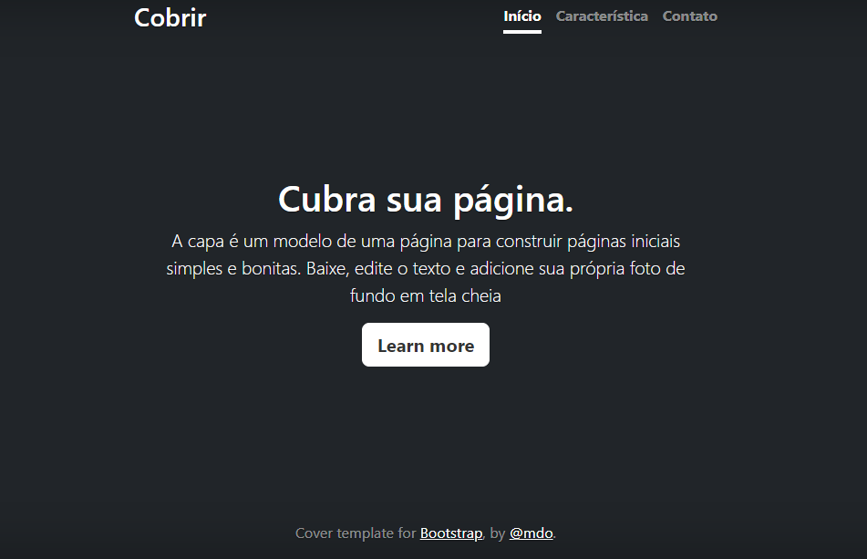

# Índice

[Projeto - Portifólio para escrita do README](#projeto---portif%C3%B3lio-para-escrita-do-readme)  
[Descrição](#descri%C3%A7%C3%A3o)  
[Funcionalidades](#funcionalidades)  
[Tecnologias utilizadas](#tecnologias-utilizadas)    
[Fontes consultadas](#fontes-consultadas)  
[Autores](#autores)  

# 🚀 Projeto - Portifólio para escrita do README 

## 📋 Descrição 

Projeto em desenvolvimento para a disciplina de Programação Web I, estamos utilizando alguns modelos já prontos , que extraimos do Bootstrap, e você vera que ao longo do caminho que realizamos algumas alterações.
[Bootstrap](https://getbootstrap.com/)
[Modelo que nós escolhemos ja com algumas alterações](file:///C:/Users/paula.vitoria/OneDrive%20-%20Grupo%20Marista/2%20ANO/programa%C3%A7%C3%A3o%20web%201/3%20trimestre/portifolio-pessoal2/index.html)

## 🔧 Funcionalidades 

## 1. Responsividade

Uma das principais características do modelo Bootstrap é a sua responsividade. Isso significa que o layout se adapta automaticamente a diferentes tamanhos de tela, como em dispositivos móveis, tablets e desktops.

## 2. Componentes Pré-estilizados

O Bootstrap oferece uma grande variedade de componentes pré-estilizados, o que facilita a criação de interfaces gráficas atraentes e consistentes. Alguns exemplos de componentes disponíveis são: botões, formulários, barras de navegação, cards, alertas, modais, entre outros. Esses componentes possuem estilos padronizados e podem ser facilmente customizados.

## 3. Biblioteca de Ícones

O modelo Bootstrap também inclui uma biblioteca de ícones, conhecida como Bootstrap Icons. Essa biblioteca contém uma grande variedade de ícones vetoriais prontos para uso, que podem ser facilmente incorporados aos seus projetos web. Os ícones podem ser redimensionados, estilizados e integrados com outros componentes.

## 4. Suporte a Plugins

Outro ponto forte do modelo Bootstrap é o suporte a plugins. Existem diversos plugins desenvolvidos pela comunidade que podem ser utilizados para adicionar funcionalidades extras ao seu projeto. Esses plugins podem ser facilmente integrados ao modelo e oferecem recursos extras sem a necessidade de desenvolvimento adicional.

## 🛠️ Tecnologias utilizadas 
Nesse projetos utilizamos, Git, GitHub, Links de como fazer um README no GitHub, VScode, Get Bootstrap, HTML, CSS, Captura de tela, Pasta de Arquivos...

## 1. Git e GitHub

O Git é um sistema de controle de versão distribuído que permite o gerenciamento de alterações em um projeto de forma eficiente. O GitHub é uma plataforma de hospedagem de código fonte que utiliza o Git como base. Ele oferece recursos avançados de colaboração e gerenciamento de projetos.

## 2. Links de Como Fazer um README no GitHub

A documentação oficial do GitHub oferece guias detalhados sobre como criar um README de forma eficiente. Os seguintes links podem ser úteis para aprender mais sobre esse assunto:

- [Writing on GitHub](https://docs.github.com/en/github/writing-on-github): Guia sobre como escrever textos e formatação básica no GitHub.
- [Mastering Markdown](https://guides.github.com/features/mastering-markdown/): Guia completo sobre a sintaxe Markdown utilizada para formatar o README e outros arquivos no GitHub.

## 3. VScode

O Visual Studio Code (VScode) é um editor de código-fonte leve e altamente personalizável. Ele oferece suporte a várias linguagens de programação e possui uma grande variedade de extensões disponíveis que podem aumentar sua produtividade durante o desenvolvimento.

## 4. Bootstrap

O Bootstrap é uma ferramenta que oferece estruturas popular e amplamente utilizado para o desenvolvimento web responsivo. Ele oferece uma variedade de componentes e estilos pré-estilizados, facilitando a criação de layouts responsivos agradáveis.

## 5. HTML e CSS

HTML (HyperText Markup Language) e CSS (Cascading Style Sheets) são as principais linguagens utilizadas no desenvolvimento de sites e páginas web. O HTML é responsável pela estrutura e marcação do conteúdo, enquanto o CSS é utilizado para estilizar e personalizar a aparência desses elementos.

## 6. Captura de Tela

Para documentar visualmente o projeto, é recomendado incluir capturas de tela relevantes. Isso pode ser feito utilizando ferramentas de captura de tela, como o Snipping Tool no Windows, ou teclas de atalho específicas nos sistemas operacionais macOS e Linux.

## 7. Pasta de Arquivos

Para uma melhor organização do projeto, é comum criar uma pasta específica para armazenar todos os arquivos relacionados a ele. Essa pasta pode conter subpastas para diferentes tipos de arquivos (por exemplo, código fonte, imagens, documentação, etc.), facilitando a localização e o acesso aos recursos.

## 8. Google e Google Tradutor

O Google é um mecanismo de pesquisa amplamente utilizado para encontrar informações sobre diversas questões relacionadas ao desenvolvimento de software. Além disso, o Google Tradutor pode ser utilizado para traduzir textos de um idioma para outro, facilitando a comunicação e o entendimento em diferentes contextos.

## 📄 Fontes consultadas 

## 1. Documentação oficial

- [Git Documentation](https://git-scm.com/doc): Documentação oficial do Git, fornecendo informações detalhadas sobre os comandos e funcionalidades.
- [GitHub Docs](https://docs.github.com/en): Documentação oficial do GitHub, oferecendo guias completos para todo o processo de gerenciamento de projetos na plataforma.

## 2. Tutoriais e Guias Online

- [Curso de Git e GitHub](https://www.udemy.com/course/git-e-github-para-iniciantes): Curso disponível na Udemy sobre Git e GitHub.
- [Mastering Markdown](https://guides.github.com/features/mastering-markdown/): Guia completo sobre a sintaxe Markdown utilizada no GitHub.
- [Bootstrap Documentation](https://getbootstrap.com/docs): Documentação do Bootstrap, com exemplos e informações sobre o uso do framework.
- [HTML Tutorial](https://www.w3schools.com/html): Tutorial detalhado sobre HTML da W3Schools, uma fonte confiável para aprender linguagens web.
- [CSS Tutorial](https://www.w3schools.com/css): Tutorial detalhado sobre CSS da W3Schools, que abrange conceitos básicos e avançados da estilização de páginas web.

## 3. Blogs e Websites

- [Medium](https://medium.com): Plataforma que abriga diversos artigos e tutoriais escritos por especialistas em diferentes áreas, incluindo desenvolvimento de software.
- [CSS-Tricks](https://css-tricks.com): Um website que fornece dicas, truques e tutoriais sobre CSS e design web.
- [Smashing Magazine](https://www.smashingmagazine.com): Um website que reúne artigos sobre desenvolvimento web, design e experiência do usuário.

## 4. Documentação do Software utilizado

- [Visual Studio Code Docs](https://code.visualstudio.com/docs): Documentação oficial do Visual Studio Code, fornecendo informações sobre recursos e extensões.
- Documentação específica do Git, GitHub, Bootstrap e outras tecnologias utilizadas também foram consultadas conforme necessário.

## ✒️ Autores 

As pessoas pricipais que me ajudaram foi o meu professor de Web e amigosa da sala.
E eu Paula Boaro.